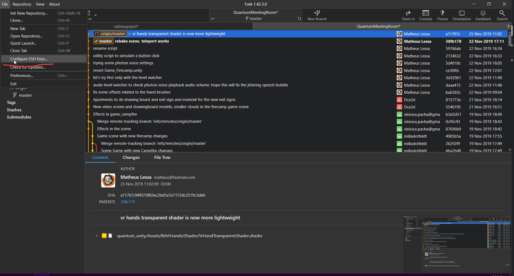
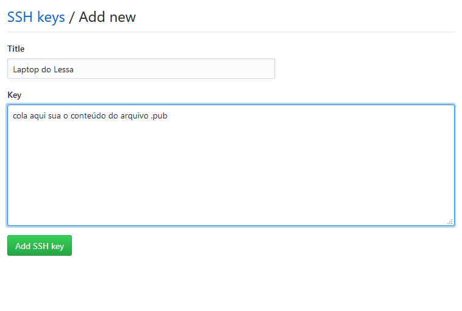
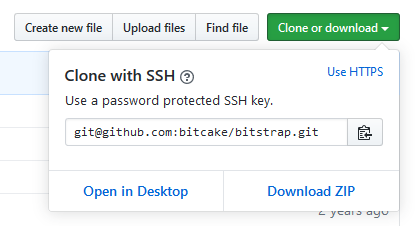

# Configurar Fork com SSH

## Gera os arquivos de chave SSH

`File > Configure SSH Keys...`

## Importar a chave no Github

- Abre a chave que tem a extensão `.pub` e copia todo o seu conteúdo
- Abre o settings da conta da BitCake no Github
- Vá até a aba `SSH and GPG keys`
- `New SSH key`
- Identifique onde essa chave irá ser utilizada em `Title` (ex: 'Laptop do Lessa')
- Cole o conteúdo do arquivo `.pub` no campo `Key`
- `Add SSH key`

## Clone por SSH

Ao clonar um repositório novo, agora você pode usar a url que usa SSH.

De resto, o git funciona normalmente

