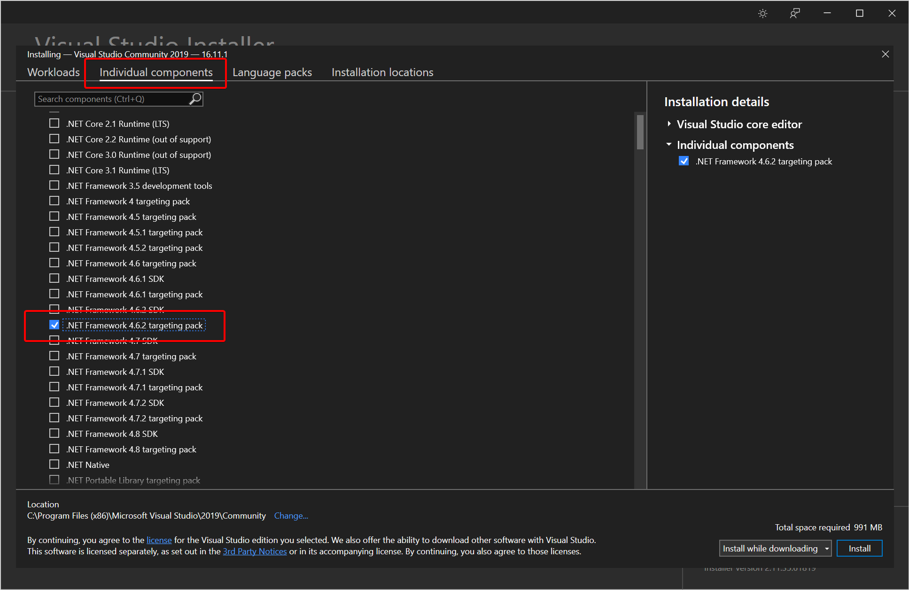
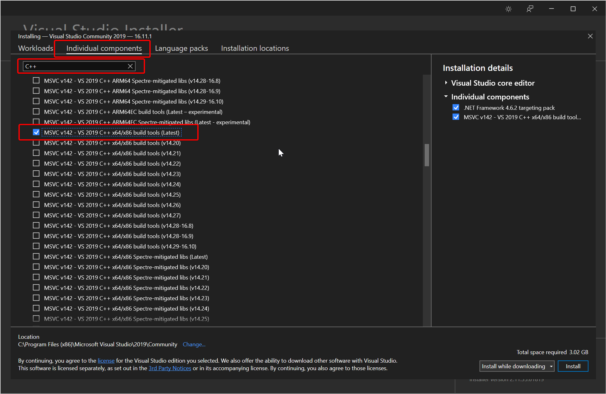
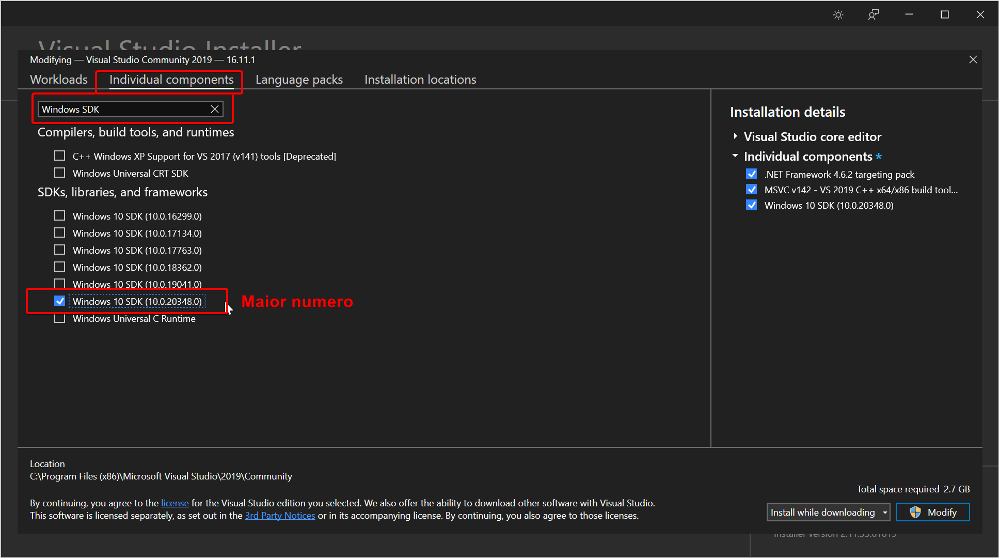

# Compilando um Projeto Unreal

## Instalando Visual Studio
Pra compilar um projeto Unreal, a gente precisa de um compilador de C++.
O recomendado pela Epic é usar o Visual Studio.
Pra isso vamos instalar o Visual Studio Community que é a versão gratuita que serve pro nosso propósito.

### Instalação
- Acesse https://visualstudio.microsoft.com/vs/community/ e clique no botão de 'Download'
- Execute o `vs_Community.exe` baixado
- Depois que carregar a interface, vá para a aba "Individual Components"
- Marque ".NET Framework 4.6.2 SDK"
- Marque ".NET Framework 4.6.2 Targeting Pack"
- 
- Procure por uma entrada parecida com "MSVC VS-2019 C++ x64/x86 build tools (Latest)" e marque-a
- 
- Marque o "Windows 10 SDK" com a maior versão
- 
- "Install"
- Se aparecer uma tela tentando te convencer a instalar um "Workload" você pode simplesmente clicar em "Continue"
- Aguarde bastante (demora mesmo)
- Uma vez que terminar o processo, pode fechar as janelas (não precisa logar com uma conta da Microsoft mesmo que ela insista bastante)

Parabéns, você agora tem o Visual Studio instalado no PC e alguns gigas livres a menos no seu HD!

## Compilando o Projeto
Finalmente podemos compilar o projeto!
- *Fechar* o editor da Unreal
- Atualizar o repositório
- Dois cliques no `open.bat` que fica na raiz do projeto (junto do `.uproject`)
  - Se tiver erro de compilação, culpe algum programador!
  - Dando tudo certo, o console que abriu deve sumir e logo depois o editor da Unreal abre
